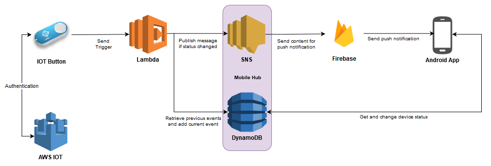

# AWS IoT: Fresh Cloud Coffee
An example project demonstrating the usage of AWS IoT buttons for reporting defect coffee machines (and other devices :p)

What does it contain?
* AWS lambda code
* Android app for devices overview

## Getting Started

## AWS Infra

## Why do this?

> Modern electronics are great. They do have a disappointing downside however: they tend to break. 
> A lot. Here at de Volksbank, we are currently asking users of coffee machines, printers, etc. to report broken systems in a system or by calling support. 
> While this generally works fine, the worst moment to ask someone to make a phonecall is 9 in the morning when he didn't have his coffee yet.
> To make the process even simpler and quicker, we wanted to automate the process even further. 
> Now coffee machines and printers can include a simple dedicated button which takes care of everything. 
> Pushing it activates a function in the cloud which notifies the right people that a machine is defect, 
> without ever needing to interact with a system or calling the help desk. This also helps the support staff who will no longer be flooded by duplicate messages: 
> if a defect has been reported once, the buttons will automatically stop sending messages until the problem has been fixed. A fun little project and a win for everyone!

## Authors

* **Wouter Poncin** - *Initial work* - [wpbs](https://github.com/wpbs)
* **Daan Knoope** - *Initial work* - [daanknoope](https://github.com/daanknoope)
* **Casper Schobers** - *Initial work* - [casperschobers](https://github.com/casperschobers)

See also the list of [contributors](https://github.com/devolksbank/AWS-IoT-Fresh-Cloud-Coffee/contributors) who participated in this project.

## License

This project is licensed under the MIT License - see the [LICENSE](LICENSE) file for details

# Contact
For any questions please don't hesitate to contact us at [tc@devolksbank.nl](mailto:tc@devolksbank.nl)

